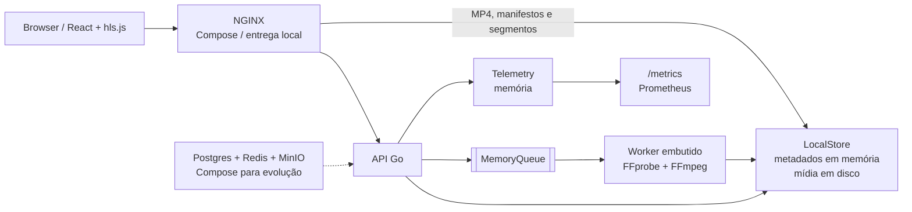
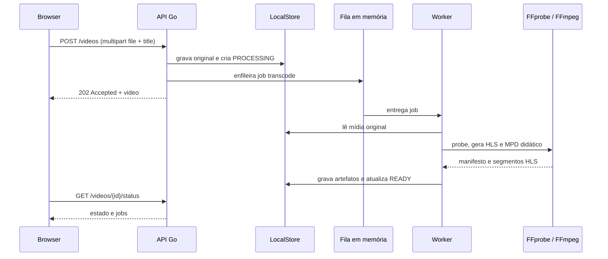
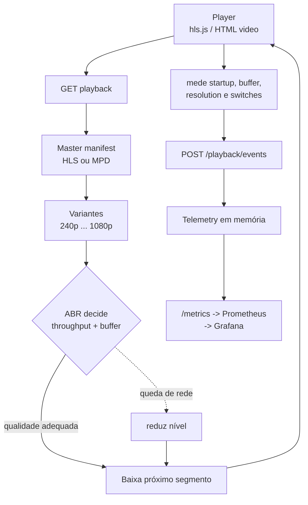

# StreamLab

Laboratório de Video on Demand para estudar ingestão, media probe, FFmpeg,
HLS, MPEG-DASH, Adaptive Bitrate Streaming (ABR) e métricas de Quality of
Experience (QoE).

O MVP combina uma API em Go, uma interface React/Vite, um worker de transcoding
embutido na API e um player com `hls.js`. A aplicação foi desenhada para evoluir
de um ambiente local simples para uma arquitetura com storage de objetos,
mensageria e processamento distribuído.

## O que este projeto demonstra

Enviar um vídeo não significa torná-lo pronto para reprodução eficiente. O
sistema precisa receber o arquivo, descobrir o que existe dentro dele, converter
codecs quando necessário, dividir a mídia em partes, entregar essas partes pela
rede e medir o que o espectador realmente percebe. O StreamLab torna esse fluxo
visível em um laboratório local:

```text
upload -> probe -> transcode -> package -> playback -> ABR -> QoE
```

Em outras palavras: este não é apenas um CRUD de vídeos. É um estudo de como um
arquivo vira uma experiência de streaming.

### Por que não entregar somente um MP4?

Um MP4 único é simples e continua sendo útil. Porém, ele não resolve bem todos
os cenários:

| Problema | O que acontece sem um pipeline de mídia |
| --- | --- |
| Internet instável | O player pode travar enquanto espera dados chegarem. |
| Celular e TV diferentes | Um único tamanho/codec pode ser pesado ou incompatível. |
| Seek | O cliente precisa buscar uma parte específica do arquivo. |
| Escala | Todos os usuários dependem da mesma origem e do mesmo bitrate. |
| Observabilidade | É difícil saber se o vídeo demorou para iniciar ou rebufferizou. |

HLS e MPEG-DASH resolvem parte disso dividindo o vídeo em segmentos e oferecendo
representações diferentes. O player escolhe o próximo segmento conforme a rede,
o buffer e o dispositivo.

### Mapa visual do projeto

Estas imagens são diagramas SVG versionados no repositório, não ilustrações
decorativas: cada uma representa uma decisão técnica que pode ser reproduzida no
Quick Start e nos experimentos.


## Entenda sem jargão

| Termo | Analogia | Tradução técnica |
| --- | --- | --- |
| **Encoding** | Regravar um filme em uma versão menor e compatível. | Transformar frames e áudio em streams comprimidos com um codec e parâmetros definidos. |
| **Codec** | O idioma usado para escrever e ler o conteúdo. | H.264, H.265, VP9, AV1, AAC e outros algoritmos de compressão/decodificação. |
| **Container** | A caixa que leva filme, áudio, timestamps e metadados. | MP4, MKV, MOV, MPEG-TS ou WebM. A caixa não é o codec. |
| **Bitrate** | A vazão de uma torneira. | Quantos bits por segundo são usados; normalmente escrito em kbps ou Mbps. |
| **Manifesto** | O índice de um livro. | M3U8 no HLS ou MPD no DASH; aponta para playlists, variantes e segmentos. |
| **Segmento** | Um capítulo curto que pode ser baixado separadamente. | Um `.ts` ou fragmento MP4 de alguns segundos. |
| **GOP/keyframe** | Uma página completa a cada grupo de páginas dependentes. | Keyframes permitem começar a decodificar; frames intermediários dependem do GOP. |
| **ABR** | Escolher entre edição pesada, média ou leve conforme a estrada. | Adaptive Bitrate seleciona a próxima representação com base em throughput e buffer. |
| **QoE** | A avaliação de quem está assistindo, não só do servidor. | Startup time, rebuffer, bitrate médio, switches e erros percebidos. |
| **CDN** | Filiais próximas ao público em vez de um único depósito central. | Cache distribuído que entrega manifestos e segmentos perto do usuário. |

### Codec não é container

Um arquivo pode ser descrito assim:

```text
filme.mp4
├── container: MP4
├── video: H.264
└── audio: AAC
```

O container organiza os streams e seus timestamps. O codec decide como cada
stream é comprimido. É possível ter H.264 dentro de MP4 ou MPEG-TS; trocar a
extensão não troca automaticamente o codec.

### Bitrate, resolução e qualidade

Resolução é o número de pixels; bitrate é quanto espaço por segundo está
disponível para representar esses pixels e o áudio. Uma imagem 1080p pode ter
bitrate baixo e artefatos ou bitrate alto e mais detalhe. Por isso uma ladder
costuma combinar resolução e bitrate, por exemplo `480p / 1.2 Mbps`, `720p / 3
Mbps` e `1080p / 5.8 Mbps`. Esses valores são alvos/anúncios e devem ser
conferidos com `ffprobe`; não são medições universais.

### GOP e keyframe

Um keyframe é um ponto que pode ser decodificado sem depender de frames
anteriores. Os demais frames podem guardar apenas diferenças. O GOP é o grupo
entre keyframes. Em 30 fps, um GOP de 48 frames equivale a aproximadamente 1,6
segundo, não 48 segundos. Segmentar perto de keyframes ajuda o player a trocar
de representação sem quebrar a decodificação. `hls_time=6` é um alvo de duração
de segmento, não uma garantia de que todos terão exatamente seis segundos.

## O caminho técnico, passo a passo

1. **Ingestão:** o navegador envia `multipart/form-data` para `POST /videos`.
   A API grava o original e responde `202 Accepted`, porque não espera o encode
   terminar para confirmar o recebimento.
2. **Fila:** um job `transcode` entra na `MemoryQueue`. Isso separa o tempo de
   upload do trabalho pesado de CPU.
3. **Media probe:** `ffprobe` lê container, streams, codecs, duração, resolução,
   bitrate e áudio. O sistema não deveria escolher uma ladder no escuro.
4. **Transcoding:** FFmpeg decodifica a origem e codifica uma saída H.264/AAC
   adequada ao navegador. No Compose, o áudio é normalizado para estéreo para
   aumentar a compatibilidade.
5. **Packaging:** o pipeline local gera uma media playlist HLS real e segmentos
   MPEG-TS. O MPD local atual é didático; os scripts de laboratório geram um
   pacote DASH completo para estudo.
6. **Distribuição:** o NGINX encaminha API e player, enquanto a API serve os
   artefatos locais. Em produção, essa função seria separada para object storage
   e CDN.
7. **Playback:** `hls.js` lê o manifesto, baixa segmentos e mantém um buffer.
   O vídeo não precisa estar inteiro no computador para começar.
8. **Medição:** o player envia eventos de play, pause, seek, quality change e
   erros. O painel mostra sinais de QoE e `/metrics` expõe contadores Prometheus.

## O que é real, didático e futuro

Ser explícito sobre limites também demonstra domínio de arquitetura:

| Camada | No StreamLab atual | Próxima evolução |
| --- | --- | --- |
| Upload | Multipart para disco local, com `Range` no original. | Presigned URL direto para S3/MinIO. |
| Probe/transcode | FFprobe/FFmpeg reais no Compose; worker em memória. | Analyzer e transcoders independentes. |
| HLS local | Playlist real de uma representação e segmentos reais. | Master playlist com ladder gerada por título. |
| ABR | Fixture HLS Mux com múltiplas rendições e scripts de ladder. | Publicar variantes próprias no player. |
| DASH local | MPD didático para inspeção. | Manifesto e segmentos DASH publicados pelo packager. |
| Dados | Catálogo, jobs e telemetria em memória. | PostgreSQL e Redis Streams/RabbitMQ. |
| Distribuição | NGINX local e volume compartilhado. | Object storage, cache de edge e CDN multi-região. |
| QoE | Eventos e contadores básicos. | Rebuffer ratio, percentis e séries temporais calculadas. |

Não confundir `READY` com “produto de produção”: no MVP ele significa que o
worker terminou o artefato que conhece. Em uma plataforma real, `READY` só seria
publicado depois de validar duração, codecs, segmentos, manifestos e todas as
representações esperadas.

## Como demonstrar domínio em cinco minutos

| Tempo | Demonstração | O que explicar |
| --- | --- | --- |
| 0:00–0:30 | Mostre o diagrama e rode o Quick Start. | O problema é transformar arquivo em experiência adaptativa. |
| 0:30–1:15 | Mostre upload, `202`, `PROCESSING` e `READY`. | Upload é assíncrono porque encode é CPU-intensive. |
| 1:15–2:00 | Abra o asset local e consulte o status/playback. | Probe, transcode, manifesto, segmentos e Range são camadas diferentes. |
| 2:00–3:00 | Abra `ABR Ladder / live probe` em `Auto`. | ABR real usa o HLS multi-rendição público; o upload local atual tem uma representação. |
| 3:00–4:00 | Mostre `/metrics`, buffer e switches. | QoE mede a experiência percebida, não apenas saúde da API. |
| 4:00–5:00 | Explique LocalStore/MemoryQueue e a arquitetura futura. | Mostre trade-offs: simplicidade local versus durabilidade, escala e CDN. |

Perguntas que este repositório permite responder:

| Pergunta | Evidência | Limite assumido |
| --- | --- | --- |
| Por que `202 Accepted`? | Job assíncrono e status polling. | A fila ainda não é durável. |
| MP4 é igual a HLS? | Diagramas, `/stream` e `/playback/hls`. | HLS local não é uma ladder própria ainda. |
| Como funciona `Range`? | Resposta `206`, `Content-Range` e experimento 001. | Range trabalha em bytes, não escolhe bitrate. |
| Como ABR troca qualidade? | Fixture Mux, `hls.js` e experimento 003. | A ladder local própria é trabalho futuro. |
| O que medir em QoE? | Eventos, painel e `/metrics`. | Rebuffer ratio e percentis ainda são experimentais. |
| Como escalar? | ADRs e arquitetura-alvo. | Postgres, Redis, MinIO e CDN ainda são fundação. |

## Quick Start: clonar, subir e testar

O caminho recomendado para uma demonstração limpa é um único script. Ele valida
as dependências, escolhe portas livres, sobe todos os serviços, baixa o Big Buck
Bunny oficial, envia o arquivo pela API, espera o estado `READY` e imprime os
links para abrir a biblioteca e o asset processado:

```bash
git clone https://github.com/gabriel-roque/streamlab.git
cd streamlab
./scripts/quick-start.sh
```

Pré-requisitos: Docker com Compose v2, `curl`, `jq` e `unzip`. O primeiro ciclo
pode levar alguns minutos porque baixa a mídia de demonstração e constrói as
imagens. O container da API já inclui FFmpeg/FFprobe, então o upload percorre o
pipeline real de probe, transcode e empacotamento HLS; o MPD local é didático e o
pacote DASH completo pode ser gerado pelos scripts.

Ao final, o terminal mostra algo semelhante a:

```text
StreamLab is ready
  Library:       http://localhost:3000/
  Asset screen:  http://localhost:3000/ (select Big Buck Bunny quick-start)
  Status API:    http://localhost:3000/api/videos/vid-.../status
  Playback API:  http://localhost:3000/api/videos/vid-.../playback
  HLS playback:  http://localhost:3000/api/videos/vid-.../playback/hls
```

Abra `Asset screen`, selecione o card com o título impresso pelo script e use o
player. Se uma porta estiver ocupada, o script escolhe outra e imprime o novo
endereço. Para reaproveitar um arquivo já baixado, use:

```bash
./scripts/quick-start.sh --skip-download
```

Nesse modo, o arquivo esperado é
`samples/raw/big-buck-bunny-1080p-normal.mp4`; também é possível definir outro
arquivo com `VIDEO_FILE=/caminho/video.mp4`.

## Estado atual

O que funciona hoje:

- Biblioteca web com busca, filtros, ordenação, visualização de detalhes e upload.
- Reprodução progressiva de MP4 e reprodução HLS quando existe um manifesto.
- Controle de play/pause, seek, volume, seleção de qualidade e leitura de buffer.
- API Go para catálogo, upload multipart, status, playback, sessões e eventos de QoE.
- `Range Requests` para mídia local.
- Fila em memória e processamento assíncrono no worker embutido da API.
- `ffprobe` e `ffmpeg` usados no container da API; a execução local sem essas
  ferramentas usa artefatos fixture para manter o fluxo demonstrável.
- Scripts independentes para baixar o fixture, inspecionar mídia, gerar ladder,
  HLS, DASH e validar os pacotes.
- Métricas Prometheus simples em `/metrics` e dashboard provisionado no Compose.

Limites importantes do MVP:

- Metadados, fila e telemetria são mantidos em memória e são perdidos ao reiniciar.
- O adapter efetivo de storage é o disco local (`LocalStore`); ele guarda mídia e
  artefatos, enquanto os metadados ficam em memória.
- Postgres, Redis e MinIO estão declarados no `docker-compose.yml` como base para
  evolução, mas ainda não são usados pelos adapters da aplicação.
- O transcoder standalone existe como esqueleto; a fila ainda não é durável nem
  compartilhada entre processos.
- Postgres, Redis e MinIO são infraestrutura declarada para estudar a evolução;
  o caminho padrão do MVP continua sendo `LocalStore` e a fila em memória.

## Quickstart local

Requisitos:

- Go 1.22 ou superior.
- Node.js 22 ou superior e npm.
- `curl` para os smoke tests.
- FFmpeg e FFprobe são recomendados para transcoding real, mas opcionais para
  iniciar a API.

Em um terminal, na raiz do repositório:

```bash
go run ./apps/api
```

A API fica em `http://localhost:8080`. O storage padrão é temporário, em
`/tmp/streamlab`; para manter os arquivos em um diretório do projeto:

```bash
STREAMLAB_STORAGE_ROOT=.streamlab-data go run ./apps/api
```

Em outro terminal:

```bash
npm ci --prefix apps/frontend
npm run dev --prefix apps/frontend
```

A interface fica em `http://localhost:5173`. Em desenvolvimento, o Vite encaminha
`/api` para `http://localhost:8080`; em produção o NGINX faz o mesmo proxy.
Para apontar para outra API:

```bash
VITE_API_URL=http://localhost:8080 npm run dev --prefix apps/frontend
```

O catálogo inicial inclui um item chamado **Big Buck Bunny**. Também é possível
enviar um arquivo local pela interface ou diretamente pela API:

```bash
curl -F "file=@samples/raw/big-buck-bunny-1080p-normal.mp4" \
  -F "title=Big Buck Bunny local" \
  http://localhost:8080/videos
```

O upload retorna `202 Accepted`. O vídeo passa por processamento e pode ser
consultado em `/videos/{id}/status` até chegar a `READY`.

## Quickstart Docker

O `scripts/quick-start.sh` já executa o Compose. Para controlar cada etapa
manualmente, a topologia completa também pode ser iniciada assim:

```bash
docker compose config
docker compose up --build
```

Se alguma porta padrão já estiver ocupada, sobrescreva apenas as portas
necessárias, por exemplo `NGINX_PORT=3100 PROMETHEUS_PORT=9190 docker compose up
--build`.

Portas previstas:

| Serviço | Endereço | Papel |
| --- | --- | --- |
| NGINX | `http://localhost:3000` | Entrada para frontend, API e mídia |
| Grafana | `http://localhost:3001` | Dashboard de observabilidade |
| Prometheus | `http://localhost:9090` | Coleta de métricas |
| MinIO API | `http://localhost:9000` | Storage S3 compatível |
| MinIO Console | `http://localhost:9001` | Console do MinIO |
| PostgreSQL | `localhost:5432` | Banco de metadados futuro |
| Redis | `localhost:6379` | Estado/fila futuro |

Verificações úteis enquanto os containers estão ativos:

```bash
docker compose ps
curl -fsS http://localhost:3000/healthz
curl -fsS http://localhost:9090/-/ready
curl -fsS http://localhost:3001/api/health
```

O serviço `api` não publica a porta 8080 no host: ele é acessível internamente
por NGINX. A aplicação web usa `/api`, portanto o mesmo bundle funciona atrás do
proxy em `http://localhost:3000`.

Para encerrar e remover os containers, mantendo os volumes:

```bash
docker compose down
```

`docker compose down` remove os containers, mas mantém os volumes. O catálogo,
jobs e telemetria continuam efêmeros porque o MVP ainda mantém esses dados em
memória; os vídeos e artefatos locais permanecem no volume `media_data`.

## Vídeo público de demonstração

O fixture recomendado é **Big Buck Bunny**, da Blender Foundation.

- Fonte oficial para download: [`bbb_sunflower_1080p_30fps_normal.mp4.zip`](https://download.blender.org/demo/movies/BBB/bbb_sunflower_1080p_30fps_normal.mp4.zip).
- Página do filme: [Blender Studio / Big Buck Bunny](https://studio.blender.org/films/big-buck-bunny/).
- Reprodução MP4 pública alternativa usada no catálogo inicial:
  [`storage.googleapis.com/gtv-videos-bucket/sample/BigBuckBunny.mp4`](https://storage.googleapis.com/gtv-videos-bucket/sample/BigBuckBunny.mp4).

Baixe e valide a fonte oficial sob demanda, sem adicionar o binário ao
repositório:

```bash
scripts/download-bbb.sh
scripts/ffprobe-media.sh --input samples/raw/big-buck-bunny-1080p-normal.mp4
```

O filme é normalmente distribuído sob [Creative Commons Attribution 3.0
](https://creativecommons.org/licenses/by/3.0/) pela Blender Foundation. Ao
redistribuir mídia, mantenha a atribuição à Blender Foundation, respeite os
termos da fonte e confirme a licença vigente no endereço oficial. O download
serve para testes locais; não é uma licença para incluir o vídeo, thumbnails ou
artefatos gerados neste projeto.

## Guia de exploração

Siga esta ordem para demonstrar o caminho completo de mídia:

1. **Biblioteca.** Abra o endereço `Library` impresso pelo Quick Start. Confirme
   `API connected`, o card do upload e o asset `ABR Ladder / live probe`. O
   primeiro representa um arquivo que passou pelo pipeline local; o segundo é um
   manifesto HLS público com múltiplas rendições.
2. **Pipeline.** Consulte o endpoint `status` do vídeo enviado. Observe a
   transição `PROCESSING` para `READY` e os jobs associados. O tempo depende de
   CPU, duração, resolução e preset do FFmpeg.
3. **Player MP4.** Abra o asset enviado. Use play, pause e seek; depois compare o
   comportamento progressivo com um request `Range`:

   ```bash
   BASE=http://localhost:PORTA/api
   VIDEO_ID=vid-cole-o-id-impresso-pelo-script
   curl -i -H 'Range: bytes=0-1023' \
     "$BASE/videos/$VIDEO_ID/stream" -o /tmp/streamlab-range.bin
   ```

   Procure `206 Partial Content`, `Accept-Ranges` e `Content-Range`.
4. **Player HLS e ABR.** Volte à biblioteca e abra `ABR Ladder / live probe`.
   Confirme `HLS / ADAPTIVE`, deixe `quality` em `Auto`, observe o buffer e
   troque manualmente entre `1080p`, `720p` e `480p`. Em seguida, abra as
   ferramentas de rede do navegador e limite a banda para observar decisões ABR.
5. **Manifesto.** Compare o manifesto e o arquivo progressivo:

   ```bash
   curl -fsS "$BASE/videos/$VIDEO_ID/playback" | jq
   curl -fsS "$BASE/videos/$VIDEO_ID/playback/hls"
   curl -fsS "$BASE/videos/$VIDEO_ID/playback/dash"
   ```

   O HLS usa playlist e segmentos; o DASH usa um MPD. O player MVP integra HLS
   com `hls.js`; DASH fica disponível para inspeção via API.
6. **QoE.** Reproduza, pause, faça seek e mude a qualidade. O painel de
   observabilidade mostra startup, buffer, resolução e switches. Verifique os
   eventos e métricas:

   ```bash
   curl -fsS "$BASE/metrics"
   ```

7. **Experimentos.** Rode `scripts/generate-ladder.sh`,
   `scripts/generate-hls.sh` e `scripts/generate-dash.sh`. Use
   `scripts/validate-media.sh` e `scripts/ffprobe-media.sh` para relacionar
   container, codec, resolução, bitrate, GOP, keyframes e duração aos artefatos.

Para uma demonstração visual, capture a biblioteca após o Quick Start e a tela
de detalhe enquanto `HLS / ADAPTIVE` e `Playback observability` estão visíveis.
Os diagramas Mermaid abaixo explicam o mesmo fluxo em nível de arquitetura.

## API resumida

A API direta local usa `http://localhost:8080`. Respostas JSON usam
`Content-Type: application/json`; eventos e sessões aceitam os campos em
`snake_case` mostrados abaixo.

| Método | Rota | Resultado | Descrição |
| --- | --- | --- | --- |
| `GET` | `/health` | `200` | Liveness da API |
| `GET` | `/metrics` | `200` | Métricas no formato Prometheus |
| `GET` | `/videos` | `200` | Lista o catálogo em memória |
| `POST` | `/videos` | `202` | Recebe multipart com campo `file` ou `video`; `title` é opcional |
| `GET` | `/videos/{id}` | `200` | Retorna metadados do vídeo |
| `GET` | `/videos/{id}/status` | `200` | Retorna vídeo e jobs da fila |
| `GET` | `/videos/{id}/stream` | `200/206` | Entrega MP4 local com suporte a `Range` |
| `GET` | `/videos/{id}/playback` | `200` | Retorna protocolos, variantes, manifestos e fonte |
| `GET` | `/videos/{id}/playback/hls` | `200` | Entrega o manifesto HLS |
| `GET` | `/videos/{id}/playback/dash` | `200` | Entrega o manifesto DASH |
| `GET` | `/videos/{id}/playback/{formato}/{arquivo}` | `200` | Entrega um artefato validado |
| `POST` | `/playback/sessions` | `201` | Abre uma sessão de QoE com `video_id` |
| `POST` | `/playback/events` | `202` | Aceita evento com `type`, `video_id`, `session_id` e payload opcional |

Exemplos:

```bash
curl http://localhost:8080/health
curl http://localhost:8080/videos
curl http://localhost:8080/videos/{id}/status
curl -H 'Range: bytes=0-1023' -o /tmp/chunk.bin \
  http://localhost:8080/videos/{id}/stream
```

Abrir uma sessão e enviar um evento:

```bash
curl -X POST http://localhost:8080/playback/sessions \
  -H 'Content-Type: application/json' \
  -d '{"video_id":"big-buck-bunny","user_id":"local-user"}'

curl -X POST http://localhost:8080/playback/events \
  -H 'Content-Type: application/json' \
  -d '{"video_id":"big-buck-bunny","session_id":"session-id","type":"play","position":0,"payload":{}}'
```

O contrato conceitual mais amplo está em [`docs/api-contract.md`](./docs/api-contract.md),
mas os endpoints acima refletem o código do MVP atual. Em particular, a API
implementada usa `/health` e o upload multipart direto em `POST /videos`.

## Pipeline de mídia

O upload grava o original no adapter local, cria um job na fila em memória e
devolve a resposta sem esperar o transcoding. No Compose, a imagem da API contém
`ffprobe` e `ffmpeg`: o worker inspeciona a mídia, gera HLS real e publica um
manifesto DASH didático no disco. Sem uma mídia válida ou sem as ferramentas
instaladas, o caminho fixture cria artefatos didáticos para que o estado possa
chegar a `READY`, mas isso não representa uma ladder de produção.

### Arquitetura do MVP



O caminho atual evita dependências externas para desenvolvimento. Postgres é o
destino natural dos metadados e jobs; Redis pode substituir a fila/estado
efêmero; MinIO pode substituir o armazenamento local por um adapter S3. Esses
serviços já aparecem no Compose para estudar a evolução, não para sugerir que o
MVP persiste dados neles.

### Upload e transcoding



O script de laboratório para uma ladder completa usa perfis H.264/AAC de
`240p`, `360p`, `480p`, `720p` e `1080p`, limitados pela resolução da entrada.
HLS e DASH usam segmentos de seis segundos por padrão.

O diagrama de ABR abaixo representa o fixture HLS multi-rendição e os pacotes
gerados pelos scripts. O upload local do MVP ainda publica uma media playlist de
uma representação; suas variantes padrão são metadados de estudo, não uma
master playlist própria.

### Playback ABR e QoE



No player, `Auto` deixa o `hls.js` escolher o nível; a seleção manual bloqueia
uma resolução quando o manifesto oferece essa variante. A telemetria registra
eventos como `play`, `pause`, `seek`, `quality_change` e rebuffer, além de
exibir buffer, startup e trocas na tela de observabilidade.

## Screenshots e ilustrações

Não há screenshots binários versionados neste MVP. As telas são reproduzíveis
com o Quick Start. As três ilustrações SVG no início deste README representam
conceitos diferentes: pipeline, entrega progressiva versus segmentada e ABR.
Os diagramas Mermaid abaixo representam a arquitetura e o fluxo de eventos.

**Biblioteca.** A página inicial mostra o estado da API, a quantidade de assets,
cards de vídeos, filtros por `READY`/`PROCESSING`/`FAILED`, busca, ordenação e o
botão de upload. Quando a API está indisponível, o frontend sinaliza `local
fallback` e permite uma prévia do arquivo apenas na sessão do navegador.

**Detalhe e player.** Ao abrir um asset, a tela reúne o player, o estado do
pipeline, metadados detectados, protocolo, resolução, bitrate e painel de
observabilidade. MP4 usa reprodução progressiva; HLS usa `hls.js` e mostra o
nível ABR atual quando o manifesto oferece múltiplas variantes.

**Visão operacional.** Os diagramas “Arquitetura do MVP”, “Upload e
transcoding” e “Playback ABR e QoE” mostram limites de componentes, a transição
para `READY` e a relação entre decisões ABR, segmentos e métricas. Os arquivos
SVG podem ser reutilizados em uma apresentação sem depender do GitHub renderizar
Mermaid.

## Validação

Validação de backend:

```bash
gofmt -d apps internal
go test ./...
```

Validação do frontend:

```bash
npm run typecheck --prefix apps/frontend
npm run test --prefix apps/frontend
npm run build --prefix apps/frontend
```

Validação dos scripts e da configuração Docker:

```bash
bash tests/scripts/test_scripts.sh
docker compose config
```

Com a aplicação disponível, o smoke test padrão verifica a interface; para a
API direta, informe a URL explicitamente:

```bash
scripts/smoke-http.sh
scripts/smoke-http.sh --url http://localhost:8080 --path /health --path /videos
```

Validação de um pacote de mídia gerado:

```bash
scripts/generate-ladder.sh
scripts/generate-hls.sh
scripts/generate-dash.sh
scripts/validate-media.sh --input samples/generated/hls --kind hls
scripts/validate-media.sh --input samples/generated/dash --kind dash
```

Os diretórios `samples/raw/` e `samples/generated/` são locais e não devem ser
commitados.

## MVP e roadmap

O plano completo está em [`Plano de Projeto — Plataforma de Streaming de Vídeo.md`](<./Plano de Projeto — Plataforma de Streaming de Vídeo.md>).

### Entregue no MVP

- Fundamentos de mídia com FFprobe, FFmpeg, H.264/AAC, bitrate, resolução e
  segmentos HLS/DASH.
- Upload local, metadados básicos, estados `PROCESSING`, `READY` e `FAILED`.
- Fila e worker assíncronos em memória.
- Streaming progressivo com `Range Requests`.
- Player HLS/MP4, ladder conceitual, ABR via `hls.js` e controles de qualidade.
- Sessão de playback, eventos de QoE, métricas Prometheus e painel inicial.
- Compose com NGINX, Postgres, Redis, MinIO, Prometheus e Grafana como fundação
  para a próxima etapa.

### Próximas etapas do plano

- Persistir catálogo e jobs em PostgreSQL.
- Trocar fila em memória por Redis Streams ou RabbitMQ e adicionar retries, DLQ
  e backpressure.
- Usar MinIO/S3 para originais e derivados, com URLs assinadas e publicação
  atômica.
- Separar analyzer, transcoder e packager em workers escaláveis.
- Corrigir e consolidar o gateway NGINX/CDN local e cache de segmentos.
- Completar MPEG-DASH no player, multi-áudio, legendas, thumbnails e preview de
  seek.
- Evoluir observabilidade, testes de carga/caos, Kubernetes e autoscaling.
- Estudar CPU versus GPU, H.264/H.265/VP9/AV1, VMAF, per-title/content-aware
  encoding, segurança, DRM conceitual e playback assinado.

## Estrutura

```text
apps/api/                 API HTTP em Go
apps/transcoder/          shell de worker standalone
apps/frontend/            React + Vite + TypeScript
internal/video/           modelos e IDs
internal/storage/         adapter local padrão
internal/queue/           fila em memória
internal/transcoder/      probe, FFmpeg e artefatos fixture
internal/telemetry/       sessões e eventos em memória
infrastructure/           Docker, NGINX, Prometheus e Grafana
scripts/                  download, geração e validação de mídia
docs/                     arquitetura, contrato, ADRs e experimentos
```

## Documentação relacionada

- [Arquitetura](./docs/architecture/README.md)
- [Contrato HTTP](./docs/api-contract.md)
- [ADRs](./docs/adr/README.md)
- [Experimentos](./docs/experiments/README.md)
- [Amostras](./samples/README.md)

## Licença e fontes

O código do StreamLab não deve ser confundido com o vídeo de demonstração nem
com dependências de terceiros. Consulte a licença efetivamente distribuída para
o código deste projeto e as licenças de cada dependência antes de redistribuir.
Para o Big Buck Bunny, use a fonte oficial da Blender Foundation, preserve a
atribuição e siga a [licença CC BY 3.0](https://creativecommons.org/licenses/by/3.0/)
conforme os termos vigentes da obra. Nenhum vídeo, manifesto ou segmento gerado
é necessário para executar os testes e não deve ser incluído no repositório.
