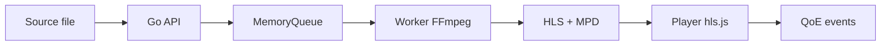
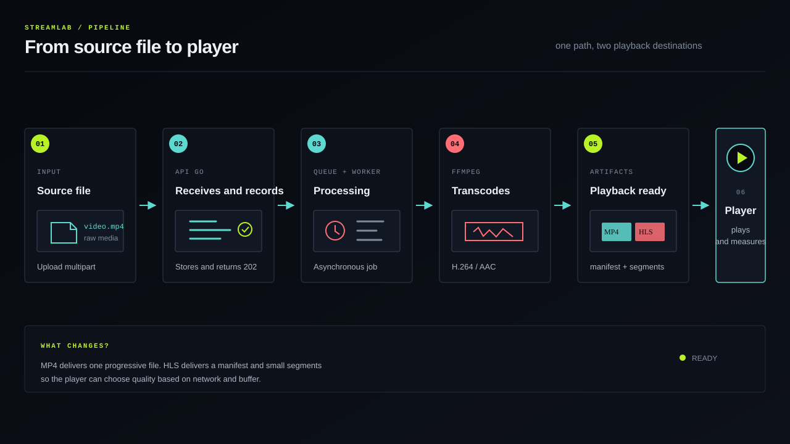
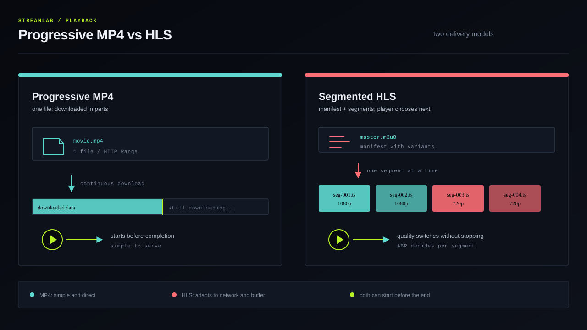
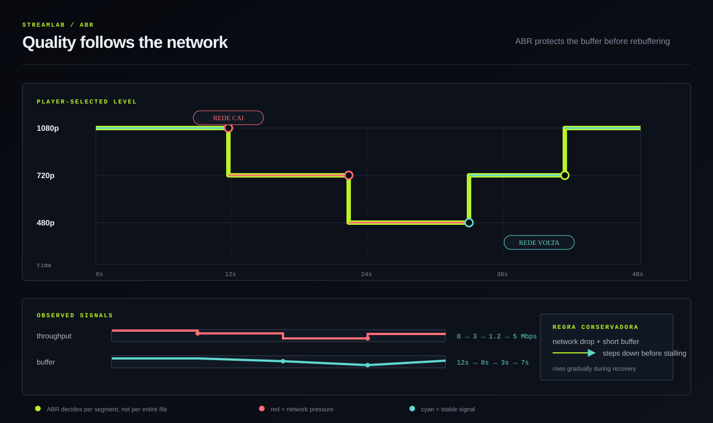

# StreamLab

Video streaming lab for studying the complete path:

```text
upload -> probe -> encoding -> HLS/DASH -> player ABR -> QoE
```

The project receives a video, analyzes its streams with FFprobe, processes the
media with FFmpeg, publishes playback artifacts, and measures player experience.

## Quick Start

Requirements: Docker Compose v2, `curl`, `jq`, and `unzip`.

```bash
git clone https://github.com/gabriel-roque/streamlab.git
cd streamlab
./scripts/quick-start.sh
```

The script:

1. Starts the full stack.
2. Automatically chooses free ports.
3. Downloads the official Big Buck Bunny.
4. Uploads it through the API.
5. Waits for `PROCESSING -> READY`.
6. Prints the library, playback, Grafana, and Prometheus links.

To reuse the already-downloaded file:

```bash
./scripts/quick-start.sh --skip-download
```

Open the `Library` address printed by the script and select the
`Big Buck Bunny quick-start` card.

## How It Works



### Key Concepts

| Concept | Short explanation |
| --- | --- |
| Codec | How video or audio is compressed, such as H.264 and AAC. |
| Container | The box that organizes streams, timestamps, and metadata, such as MP4. |
| Bitrate | Number of bits per second used to represent the media. |
| Manifest | Index pointing to playlists, variants, and segments. |
| Segment | Short part of the video downloaded by the player. |
| ABR | Automatic quality selection based on network and buffer conditions. |
| QoE | Measurement of what the viewer perceives: startup, buffering, and switches. |

### Why Not MP4 Only?

Progressive MP4 is simple, but a single version can be too heavy for a slow
network or incompatible with a device. HLS divides the video into segments and
can offer different qualities. The player chooses the next quality without
downloading the entire file.







## Demo

### Through the UI

1. Open the library at the address shown by Quick Start.
2. Open `Big Buck Bunny quick-start` to view the processed asset.
3. Observe the protocol, resolution, bitrate, buffer, and `READY` status.
4. Open `ABR Ladder / live probe` to test multi-variant HLS.
5. Leave `quality` set to `Auto` or select `1080p`, `720p`, or `480p`.

### Through the API

```bash
BASE=http://localhost:3000/api
VIDEO_ID=vid-paste-the-id-from-script

curl -fsS "$BASE/videos/$VIDEO_ID/status" | jq
curl -fsS "$BASE/videos/$VIDEO_ID/playback" | jq
curl -fsS "$BASE/videos/$VIDEO_ID/playback/hls"
curl -fsS "$BASE/metrics"
```

Test HTTP Range:

```bash
curl -i -H 'Range: bytes=0-1023' \
  "$BASE/videos/$VIDEO_ID/stream" \
  -o /tmp/streamlab-range.bin
```

The expected result is `206 Partial Content`, `Accept-Ranges`, and `Content-Range`.

## Current Limits

| Area | MVP status |
| --- | --- |
| Upload and probe | Real in Compose, using local disk and FFmpeg/FFprobe. |
| Local HLS | Real manifest and segments for one representation. |
| ABR | Demonstrated by the public HLS fixture and ladder scripts. |
| Local DASH | Educational MPD for inspection; scripts generate full DASH. |
| Data and queue | In memory, so restarting loses the catalog, jobs, and telemetry. |
| Infrastructure | PostgreSQL, Redis, and MinIO are in Compose for future evolution. |
| Production | Object storage, CDN, distributed workers, and authentication are still missing. |

This separation is intentional: the project shows the real local flow and
documents the path to a distributed architecture.

## What It Demonstrates

The project provides practical evidence of knowledge in:

- Encoding, transcoding, codecs, containers, and bitrate.
- FFprobe, FFmpeg, HLS, MPEG-DASH, and segments.
- HTTP Range Requests and progressive streaming.
- Adaptive Bitrate Streaming and buffering.
- Queues, asynchronous processing, retries, and conceptual DLQ.
- Playback telemetry and QoE metrics.
- Object storage, caching, CDN, and scalability as next steps.

## Documentation

- [HTTP contract](./docs/api-contract.md)
- [Architecture](./docs/architecture/README.md)
- [ADRs](./docs/adr/README.md)
- [Experiments](./docs/experiments/README.md)
- [Media samples](./samples/README.md)

## Sources

Quick Start downloads Big Buck Bunny from the Blender Foundation on demand. The
catalog also includes a public HLS fixture from Mux for testing ABR. Videos are
not versioned in this repository.

- [Big Buck Bunny](https://studio.blender.org/films/big-buck-bunny/)
- [Official download source](https://download.blender.org/demo/movies/BBB/bbb_sunflower_1080p_30fps_normal.mp4.zip)
- [Fixture HLS Mux](https://test-streams.mux.dev/x36xhzz/x36xhzz.m3u8)
