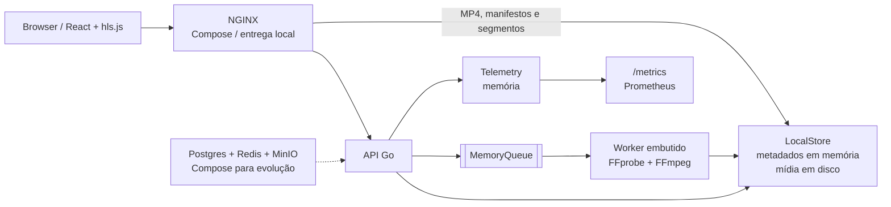
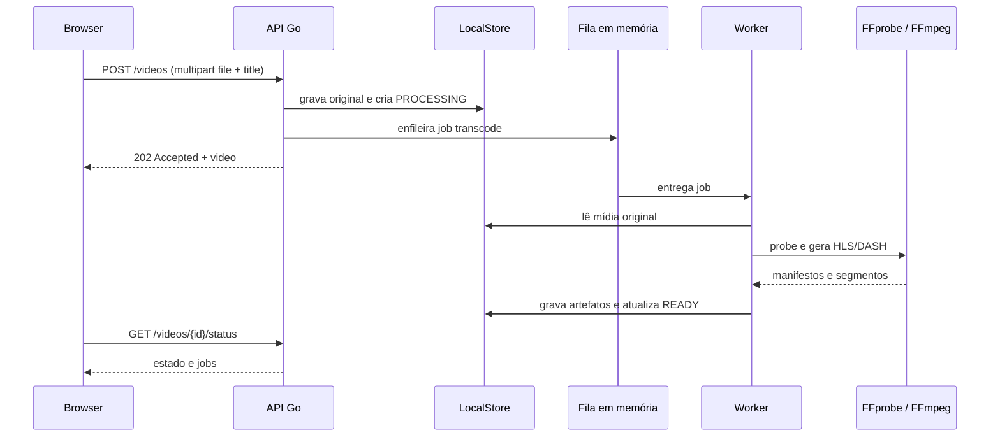
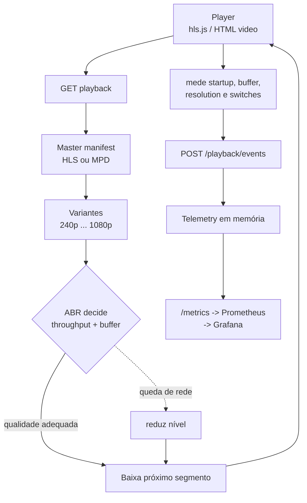

# StreamLab

Laboratório de Video on Demand para estudar ingestão, media probe, FFmpeg,
HLS, MPEG-DASH, Adaptive Bitrate Streaming (ABR) e métricas de Quality of
Experience (QoE).

O MVP combina uma API em Go, uma interface React/Vite, um worker de transcoding
embutido na API e um player com `hls.js`. A aplicação foi desenhada para evoluir
de um ambiente local simples para uma arquitetura com storage de objetos,
mensageria e processamento distribuído.

## Estado atual

O que funciona hoje:

- Biblioteca web com busca, filtros, ordenação, visualização de detalhes e upload.
- Reprodução progressiva de MP4 e reprodução HLS quando existe um manifesto.
- Controle de play/pause, seek, volume, seleção de qualidade e leitura de buffer.
- API Go para catálogo, upload multipart, status, playback, sessões e eventos de QoE.
- `Range Requests` para mídia local.
- Fila em memória e processamento assíncrono no worker embutido da API.
- `ffprobe` e `ffmpeg` usados quando estão instalados; sem eles, o pipeline usa
  artefatos fixture para manter o fluxo demonstrável.
- Scripts independentes para baixar o fixture, inspecionar mídia, gerar ladder,
  HLS, DASH e validar os pacotes.
- Métricas Prometheus simples em `/metrics` e dashboard provisionado no Compose.

Limites importantes do MVP:

- Metadados, fila e telemetria são mantidos em memória e são perdidos ao reiniciar.
- O adapter efetivo de storage é o disco local (`LocalStore`); ele guarda mídia e
  artefatos, enquanto os metadados ficam em memória.
- Postgres, Redis e MinIO estão declarados no `docker-compose.yml` como base para
  evolução, mas ainda não são usados pelos adapters da aplicação.
- O transcoder standalone existe como esqueleto; a fila ainda não é durável nem
  compartilhada entre processos.
- Postgres, Redis e MinIO são infraestrutura declarada para estudar a evolução;
  o caminho padrão do MVP continua sendo `LocalStore` e a fila em memória.

## Quickstart local

Requisitos:

- Go 1.22 ou superior.
- Node.js 22 ou superior e npm.
- `curl` para os smoke tests.
- FFmpeg e FFprobe são recomendados para transcoding real, mas opcionais para
  iniciar a API.

Em um terminal, na raiz do repositório:

```bash
go run ./apps/api
```

A API fica em `http://localhost:8080`. O storage padrão é temporário, em
`/tmp/streamlab`; para manter os arquivos em um diretório do projeto:

```bash
STREAMLAB_STORAGE_ROOT=.streamlab-data go run ./apps/api
```

Em outro terminal:

```bash
npm ci --prefix apps/frontend
npm run dev --prefix apps/frontend
```

A interface fica em `http://localhost:5173`. Em desenvolvimento, o Vite encaminha
`/api` para `http://localhost:8080`; em produção o NGINX faz o mesmo proxy.
Para apontar para outra API:

```bash
VITE_API_URL=http://localhost:8080 npm run dev --prefix apps/frontend
```

O catálogo inicial inclui um item chamado **Big Buck Bunny**. Também é possível
enviar um arquivo local pela interface ou diretamente pela API:

```bash
curl -F "file=@samples/raw/big-buck-bunny-1080p-normal.mp4" \
  -F "title=Big Buck Bunny local" \
  http://localhost:8080/videos
```

O upload retorna `202 Accepted`. O vídeo passa por processamento e pode ser
consultado em `/videos/{id}/status` até chegar a `READY`.

## Quickstart Docker

O Compose define a topologia de evolução completa:

```bash
docker compose config
docker compose up --build
```

Se alguma porta padrão já estiver ocupada, sobrescreva apenas as portas
necessárias, por exemplo `NGINX_PORT=3100 PROMETHEUS_PORT=9190 docker compose up
--build`.

Portas previstas:

| Serviço | Endereço | Papel |
| --- | --- | --- |
| NGINX | `http://localhost:3000` | Entrada para frontend, API e mídia |
| Grafana | `http://localhost:3001` | Dashboard de observabilidade |
| Prometheus | `http://localhost:9090` | Coleta de métricas |
| MinIO API | `http://localhost:9000` | Storage S3 compatível |
| MinIO Console | `http://localhost:9001` | Console do MinIO |
| PostgreSQL | `localhost:5432` | Banco de metadados futuro |
| Redis | `localhost:6379` | Estado/fila futuro |

Verificações úteis enquanto os containers estão ativos:

```bash
docker compose ps
curl -fsS http://localhost:3000/healthz
curl -fsS http://localhost:9090/-/ready
curl -fsS http://localhost:3001/api/health
```

O serviço `api` não publica a porta 8080 no host: ele é acessível internamente
por NGINX. A aplicação web usa `/api`, portanto o mesmo bundle funciona atrás do
proxy em `http://localhost:3000`.

Para encerrar e remover os containers, mantendo os volumes:

```bash
docker compose down
```

## Vídeo público de demonstração

O fixture recomendado é **Big Buck Bunny**, da Blender Foundation.

- Fonte oficial para download: [`bbb_sunflower_1080p_30fps_normal.mp4.zip`](https://download.blender.org/demo/movies/BBB/bbb_sunflower_1080p_30fps_normal.mp4.zip).
- Página do filme: [Blender Studio / Big Buck Bunny](https://studio.blender.org/films/big-buck-bunny/).
- Reprodução MP4 pública alternativa usada no catálogo inicial:
  [`storage.googleapis.com/gtv-videos-bucket/sample/BigBuckBunny.mp4`](https://storage.googleapis.com/gtv-videos-bucket/sample/BigBuckBunny.mp4).

Baixe e valide a fonte oficial sob demanda, sem adicionar o binário ao
repositório:

```bash
scripts/download-bbb.sh
scripts/ffprobe-media.sh --input samples/raw/big-buck-bunny-1080p-normal.mp4
```

O filme é normalmente distribuído sob [Creative Commons Attribution 3.0
](https://creativecommons.org/licenses/by/3.0/) pela Blender Foundation. Ao
redistribuir mídia, mantenha a atribuição à Blender Foundation, respeite os
termos da fonte e confirme a licença vigente no endereço oficial. O download
serve para testes locais; não é uma licença para incluir o vídeo, thumbnails ou
artefatos gerados neste projeto.

## API resumida

A API direta local usa `http://localhost:8080`. Respostas JSON usam
`Content-Type: application/json`; eventos e sessões aceitam os campos em
`snake_case` mostrados abaixo.

| Método | Rota | Resultado | Descrição |
| --- | --- | --- | --- |
| `GET` | `/health` | `200` | Liveness da API |
| `GET` | `/metrics` | `200` | Métricas no formato Prometheus |
| `GET` | `/videos` | `200` | Lista o catálogo em memória |
| `POST` | `/videos` | `202` | Recebe multipart com campo `file` ou `video`; `title` é opcional |
| `GET` | `/videos/{id}` | `200` | Retorna metadados do vídeo |
| `GET` | `/videos/{id}/status` | `200` | Retorna vídeo e jobs da fila |
| `GET` | `/videos/{id}/stream` | `200/206` | Entrega MP4 local com suporte a `Range` |
| `GET` | `/videos/{id}/playback` | `200` | Retorna protocolos, variantes, manifestos e fonte |
| `GET` | `/videos/{id}/playback/hls` | `200` | Entrega o manifesto HLS |
| `GET` | `/videos/{id}/playback/dash` | `200` | Entrega o manifesto DASH |
| `GET` | `/videos/{id}/playback/{formato}/{arquivo}` | `200` | Entrega um artefato validado |
| `POST` | `/playback/sessions` | `201` | Abre uma sessão de QoE com `video_id` |
| `POST` | `/playback/events` | `202` | Aceita evento com `type`, `video_id`, `session_id` e payload opcional |

Exemplos:

```bash
curl http://localhost:8080/health
curl http://localhost:8080/videos
curl http://localhost:8080/videos/{id}/status
curl -H 'Range: bytes=0-1023' -o /tmp/chunk.bin \
  http://localhost:8080/videos/{id}/stream
```

Abrir uma sessão e enviar um evento:

```bash
curl -X POST http://localhost:8080/playback/sessions \
  -H 'Content-Type: application/json' \
  -d '{"video_id":"big-buck-bunny","user_id":"local-user"}'

curl -X POST http://localhost:8080/playback/events \
  -H 'Content-Type: application/json' \
  -d '{"video_id":"big-buck-bunny","session_id":"session-id","type":"play","position":0,"payload":{}}'
```

O contrato conceitual mais amplo está em [`docs/api-contract.md`](./docs/api-contract.md),
mas os endpoints acima refletem o código do MVP atual. Em particular, a API
implementada usa `/health` e o upload multipart direto em `POST /videos`.

## Pipeline de mídia

O upload grava o original no adapter local, cria um job na fila em memória e
devolve a resposta sem esperar o transcoding. O worker executa `ffprobe` quando
possível, tenta gerar HLS com FFmpeg e publica manifesto HLS/DASH no disco. Sem
uma mídia válida ou sem as ferramentas instaladas, o caminho fixture cria
artefatos mínimos para que o estado possa chegar a `READY`, mas isso não
representa uma ladder de produção.

### Arquitetura do MVP



O caminho atual evita dependências externas para desenvolvimento. Postgres é o
destino natural dos metadados e jobs; Redis pode substituir a fila/estado
efêmero; MinIO pode substituir o armazenamento local por um adapter S3. Esses
serviços já aparecem no Compose para estudar a evolução, não para sugerir que o
MVP persiste dados neles.

### Upload e transcoding



O script de laboratório para uma ladder completa usa perfis H.264/AAC de
`240p`, `360p`, `480p`, `720p` e `1080p`, limitados pela resolução da entrada.
HLS e DASH usam segmentos de seis segundos por padrão.

### Playback ABR e QoE



No player, `Auto` deixa o `hls.js` escolher o nível; a seleção manual bloqueia
uma resolução quando o manifesto oferece essa variante. A telemetria registra
eventos como `play`, `pause`, `seek`, `quality_change` e rebuffer, além de
exibir buffer, startup e trocas na tela de observabilidade.

## Screenshots e ilustrações

Não há screenshots binários versionados neste MVP. As telas são reproduzíveis
com o quickstart acima e as ilustrações Mermaid desta seção representam o
funcionamento observado na interface.

**Biblioteca.** A página inicial mostra o estado da API, a quantidade de assets,
cards de vídeos, filtros por `READY`/`PROCESSING`/`FAILED`, busca, ordenação e o
botão de upload. Quando a API está indisponível, o frontend sinaliza `local
fallback` e permite uma prévia do arquivo apenas na sessão do navegador.

**Detalhe e player.** Ao abrir um asset, a tela reúne o player, o estado do
pipeline, metadados detectados, protocolo, resolução, bitrate e painel de
observabilidade. MP4 usa reprodução progressiva; HLS usa `hls.js` e mostra o
nível ABR atual quando o manifesto oferece múltiplas variantes.

**Visão operacional.** Os diagramas “Arquitetura do MVP”, “Upload e
transcoding” e “Playback ABR e QoE” acima são as ilustrações principais: o
primeiro mostra limites de componentes, o segundo mostra a transição para
`READY` e o terceiro mostra a relação entre decisões ABR, segmentos e métricas.

## Validação

Validação de backend:

```bash
gofmt -d apps internal
go test ./...
```

Validação do frontend:

```bash
npm run typecheck --prefix apps/frontend
npm run test --prefix apps/frontend
npm run build --prefix apps/frontend
```

Validação dos scripts e da configuração Docker:

```bash
bash tests/scripts/test_scripts.sh
docker compose config
```

Com a aplicação disponível, o smoke test padrão verifica a interface; para a
API direta, informe a URL explicitamente:

```bash
scripts/smoke-http.sh
scripts/smoke-http.sh --url http://localhost:8080 --path /health --path /videos
```

Validação de um pacote de mídia gerado:

```bash
scripts/generate-ladder.sh
scripts/generate-hls.sh
scripts/generate-dash.sh
scripts/validate-media.sh --input samples/generated/hls --kind hls
scripts/validate-media.sh --input samples/generated/dash --kind dash
```

Os diretórios `samples/raw/` e `samples/generated/` são locais e não devem ser
commitados.

## MVP e roadmap

O plano completo está em [`Plano de Projeto — Plataforma de Streaming de Vídeo.md`](<./Plano de Projeto — Plataforma de Streaming de Vídeo.md>).

### Entregue no MVP

- Fundamentos de mídia com FFprobe, FFmpeg, H.264/AAC, bitrate, resolução e
  segmentos HLS/DASH.
- Upload local, metadados básicos, estados `PROCESSING`, `READY` e `FAILED`.
- Fila e worker assíncronos em memória.
- Streaming progressivo com `Range Requests`.
- Player HLS/MP4, ladder conceitual, ABR via `hls.js` e controles de qualidade.
- Sessão de playback, eventos de QoE, métricas Prometheus e painel inicial.
- Compose com NGINX, Postgres, Redis, MinIO, Prometheus e Grafana como fundação
  para a próxima etapa.

### Próximas etapas do plano

- Persistir catálogo e jobs em PostgreSQL.
- Trocar fila em memória por Redis Streams ou RabbitMQ e adicionar retries, DLQ
  e backpressure.
- Usar MinIO/S3 para originais e derivados, com URLs assinadas e publicação
  atômica.
- Separar analyzer, transcoder e packager em workers escaláveis.
- Corrigir e consolidar o gateway NGINX/CDN local e cache de segmentos.
- Completar MPEG-DASH no player, multi-áudio, legendas, thumbnails e preview de
  seek.
- Evoluir observabilidade, testes de carga/caos, Kubernetes e autoscaling.
- Estudar CPU versus GPU, H.264/H.265/VP9/AV1, VMAF, per-title/content-aware
  encoding, segurança, DRM conceitual e playback assinado.

## Estrutura

```text
apps/api/                 API HTTP em Go
apps/transcoder/          shell de worker standalone
apps/frontend/            React + Vite + TypeScript
internal/video/           modelos e IDs
internal/storage/         adapter local padrão
internal/queue/           fila em memória
internal/transcoder/      probe, FFmpeg e artefatos fixture
internal/telemetry/       sessões e eventos em memória
infrastructure/           Docker, NGINX, Prometheus e Grafana
scripts/                  download, geração e validação de mídia
docs/                     arquitetura, contrato, ADRs e experimentos
```

## Documentação relacionada

- [Arquitetura](./docs/architecture/README.md)
- [Contrato HTTP](./docs/api-contract.md)
- [ADRs](./docs/adr/README.md)
- [Experimentos](./docs/experiments/README.md)
- [Amostras](./samples/README.md)

## Licença e fontes

O código do StreamLab não deve ser confundido com o vídeo de demonstração nem
com dependências de terceiros. Consulte a licença efetivamente distribuída para
o código deste projeto e as licenças de cada dependência antes de redistribuir.
Para o Big Buck Bunny, use a fonte oficial da Blender Foundation, preserve a
atribuição e siga a [licença CC BY 3.0](https://creativecommons.org/licenses/by/3.0/)
conforme os termos vigentes da obra. Nenhum vídeo, manifesto ou segmento gerado
é necessário para executar os testes e não deve ser incluído no repositório.
