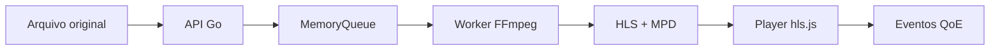

# StreamLab

Laboratório de streaming de vídeo para estudar o caminho completo:

```text
upload -> probe -> encoding -> HLS/DASH -> player ABR -> QoE
```

O projeto recebe um vídeo, analisa seus streams com FFprobe, processa a mídia
com FFmpeg, publica artefatos de playback e mede a experiência do player.

## Quick Start

Requisitos: Docker Compose v2, `curl`, `jq` e `unzip`.

```bash
git clone https://github.com/gabriel-roque/streamlab.git
cd streamlab
./scripts/quick-start.sh
```

O script:

1. Sobe a stack completa.
2. Escolhe portas livres automaticamente.
3. Baixa o Big Buck Bunny oficial.
4. Faz upload pela API.
5. Aguarda `PROCESSING -> READY`.
6. Imprime os links da biblioteca, playback, Grafana e Prometheus.

Para reutilizar o arquivo já baixado:

```bash
./scripts/quick-start.sh --skip-download
```

Abra o endereço `Library` impresso pelo script e selecione o card
`Big Buck Bunny quick-start`.

## Como Funciona



### Key Words

| Conceito | Explicação curta |
| --- | --- |
| Codec | Como vídeo ou áudio é comprimido, por exemplo H.264 e AAC. |
| Container | A caixa que organiza streams, timestamps e metadados, por exemplo MP4. |
| Bitrate | Quantidade de bits por segundo usada para representar a mídia. |
| Manifesto | Índice que aponta para playlists, variantes e segmentos. |
| Segmento | Parte curta do vídeo baixada pelo player. |
| ABR | Escolha automática de qualidade conforme rede e buffer. |
| QoE | Medição do que o espectador percebe: startup, buffer e switches. |

### Por que não somente MP4?

MP4 progressivo é simples, mas uma única versão pode ser pesada para uma rede
lenta ou incompatível com um dispositivo. HLS divide o vídeo em segmentos e pode
oferecer diferentes qualidades. O player escolhe a próxima qualidade sem baixar
o arquivo inteiro.


## Demonstração

### Pela interface

1. Abra a biblioteca no endereço mostrado pelo Quick Start.
2. Abra `Big Buck Bunny quick-start` para ver o asset processado.
3. Observe protocolo, resolução, bitrate, buffer e estado `READY`.
4. Abra `ABR Ladder / live probe` para testar HLS multi-rendição.
5. Deixe `quality` em `Auto` ou selecione `1080p`, `720p` e `480p`.

### Pela API

```bash
BASE=http://localhost:3000/api
VIDEO_ID=vid-cole-o-id-do-script

curl -fsS "$BASE/videos/$VIDEO_ID/status" | jq
curl -fsS "$BASE/videos/$VIDEO_ID/playback" | jq
curl -fsS "$BASE/videos/$VIDEO_ID/playback/hls"
curl -fsS "$BASE/metrics"
```

Teste HTTP Range:

```bash
curl -i -H 'Range: bytes=0-1023' \
  "$BASE/videos/$VIDEO_ID/stream" \
  -o /tmp/streamlab-range.bin
```

O esperado é `206 Partial Content`, `Accept-Ranges` e `Content-Range`.

## Limites Atuais

| Área | Estado do MVP |
| --- | --- |
| Upload e probe | Reais no Compose, usando disco local e FFmpeg/FFprobe. |
| HLS local | Manifesto e segmentos reais de uma representação. |
| ABR | Demonstrado pelo fixture HLS público e pelos scripts de ladder. |
| DASH local | MPD didático para inspeção; scripts geram DASH completo. |
| Dados e fila | Em memória, portanto reiniciar perde catálogo, jobs e telemetria. |
| Infraestrutura | PostgreSQL, Redis e MinIO estão no Compose para evolução. |
| Produção | Ainda faltam storage de objetos, CDN, workers distribuídos e autenticação. |

Essa separação é intencional: o projeto mostra o fluxo real local e documenta o
caminho para uma arquitetura distribuída.

## O Que Demonstra

O projeto serve como evidência prática de conhecimento em:

- Encoding, transcoding, codecs, containers e bitrate.
- FFprobe, FFmpeg, HLS, MPEG-DASH e segmentos.
- HTTP Range Requests e streaming progressivo.
- Adaptive Bitrate Streaming e buffer.
- Filas, processamento assíncrono, retries e DLQ conceitual.
- Telemetria de playback e métricas de QoE.
- Object storage, cache, CDN e escalabilidade como próximos passos.

## Documentação

- [Contrato HTTP](./docs/api-contract.md)
- [Arquitetura](./docs/architecture/README.md)
- [ADRs](./docs/adr/README.md)
- [Experimentos](./docs/experiments/README.md)
- [Amostras de mídia](./samples/README.md)
- [Plano completo do projeto](<./Plano de Projeto — Plataforma de Streaming de Vídeo.md>)

## Fontes

O Quick Start baixa o Big Buck Bunny da Blender Foundation sob demanda. O
catálogo também possui um fixture HLS público da Mux para testar ABR. Os vídeos
não são versionados neste repositório.

- [Big Buck Bunny](https://studio.blender.org/films/big-buck-bunny/)
- [Fonte oficial para download](https://download.blender.org/demo/movies/BBB/bbb_sunflower_1080p_30fps_normal.mp4.zip)
- [Fixture HLS Mux](https://test-streams.mux.dev/x36xhzz/x36xhzz.m3u8)
