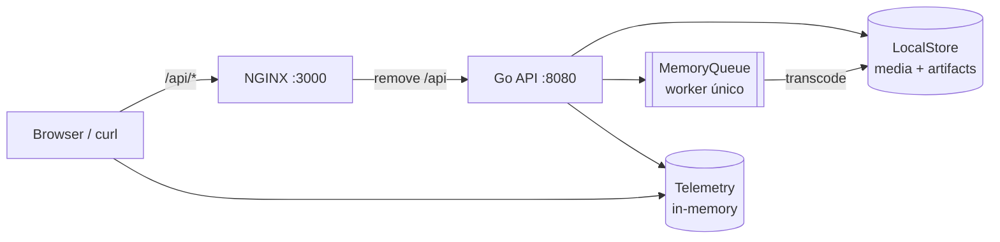
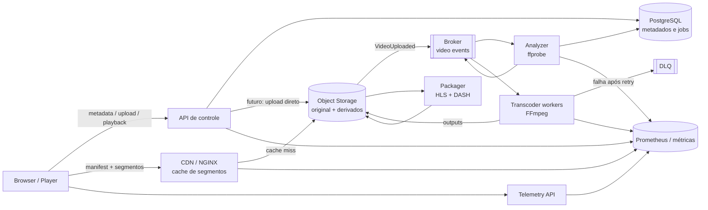

# Arquitetura do StreamLab

O repositório contém uma implementação local mínima e uma arquitetura-alvo
para estudo. Esta distinção é importante: hoje a API Go usa memória, filesystem
local e uma fila em memória; PostgreSQL, Redis e MinIO são serviços provisionados
no Compose, mas ainda não são usados pelo código da API.

## Caminho implementado hoje



- `POST /videos` com multipart grava o arquivo no storage local, responde `202`
  e enfileira um job `transcode`; o campo multipart recomendado é `file`.
- O worker tenta `ffprobe`/`ffmpeg` quando os binários existem. Caso contrário,
  publica fixtures HLS/DASH para manter o laboratório executável.
- O processador publica `hls.m3u8` e `manifest.mpd` e marca o vídeo como
  `READY`; o HLS do fixture é uma playlist de mídia, não uma master com ladder.
- `/videos/{id}/stream` entrega o arquivo original local com `Range`; manifests e
  artefatos são entregues por `/videos/{id}/playback/...`.
- O catálogo e a telemetria são perdidos ao reiniciar a API. A fila tem tamanho
  32 e retry em memória, com máximo padrão de três tentativas e DLQ em memória.

## Diagrama da arquitetura-alvo

O desenho abaixo é didático e não representa conexões já implementadas:



Na arquitetura-alvo, a API não deve transportar segmentos, o object storage é
a fonte de verdade dos bytes, consumidores são idempotentes e `READY` só é
publicado após validar as variantes. Essas propriedades ainda são objetivos de
evolução, não garantias do laboratório atual.

## Compose e portas

```bash
docker compose up --build
curl http://localhost:3000/api/healthz
```

O frontend fica em `http://localhost:3000`; o proxy usa `http://localhost:3000/api`
para a API. O serviço `api` expõe `8080` apenas na rede do Compose. Portas
publicadas adicionais são Postgres `5432`, Redis `6379`, MinIO `9000` e console
MinIO `9001`, Prometheus `9090` e Grafana `3001`. Elas não mudam o fato de que a
implementação Go usa `LocalStore`; os valores de `DATABASE_URL`, `REDIS_URL` e
`MINIO_*` presentes no Compose são preparação para a arquitetura-alvo.

Para executar a API fora do Compose:

```bash
go run ./apps/api
curl http://localhost:8080/health
```

Nesse modo, `PORT` altera a porta e `STREAMLAB_STORAGE_ROOT` (ou `STORAGE_PATH`)
altera o diretório de `media/` e `artifacts/`. A API sem `CORS_ORIGIN` responde
`Access-Control-Allow-Origin: *`.

## Laboratório de encoding

Os scripts em `scripts/` são independentes da API e usam FFmpeg local ou, na
ausência dele, Docker. A imagem da API no Compose também instala FFmpeg/FFprobe,
por isso o Quick Start exercita probe e empacotamento HLS real:

```bash
scripts/download-bbb.sh
scripts/ffprobe-media.sh --input samples/raw/big-buck-bunny-1080p-normal.mp4 --output samples/generated/bbb.json
scripts/generate-ladder.sh --input samples/raw/big-buck-bunny-1080p-normal.mp4
scripts/generate-hls.sh --input samples/raw/big-buck-bunny-1080p-normal.mp4 --segment-seconds 6 --overwrite
scripts/generate-dash.sh --input samples/raw/big-buck-bunny-1080p-normal.mp4 --segment-seconds 6 --overwrite
scripts/validate-media.sh --input samples/generated/hls --kind hls
scripts/validate-media.sh --input samples/generated/dash --kind dash
```

Use `MEDIA_TOOL=local` para exigir ferramentas locais ou
`MEDIA_TOOL=docker` para usar `jrottenberg/ffmpeg:6.1-ubuntu`. Compare sempre o
manifesto gerado, os `#EXTINF`, os segmentos, `Representation`, codec, resolução
e bitrate; `hls_time`/`seg_duration` são alvos, então valide a duração efetiva.
Se a API for executada fora do Compose sem FFmpeg/FFprobe, ela usa fixtures
didáticos e isso deve ser tratado como um caminho de fallback, não como encoding
de produção.

## Fontes públicas

Por padrão a API sem `DisableSeed` cria `big-buck-bunny`, apontando para o MP4
público do Google, e `abr-lab`, apontando para o master HLS público do Mux.
Esses itens são catálogo remoto: não há bytes locais nem manifests locais para
eles. O upload/geração local usa a fonte oficial Blender documentada em
`samples/README.md`.

## Documentos relacionados

- [Contrato HTTP](../api-contract.md)
- [ADRs](../adr/README.md)
- [Experimentos](../experiments/README.md)
