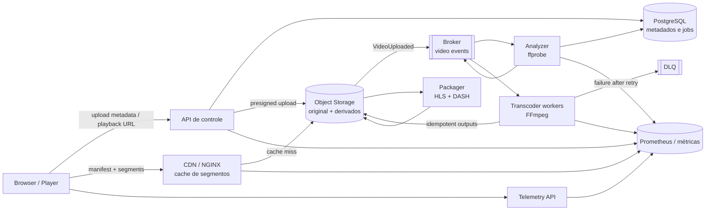

# Arquitetura do StreamLab

O laboratório separa o caminho de ingestão do caminho de entrega. O original é
imutável em object storage; workers produzem variantes e pacotes derivados; o
CDN entrega manifests e segmentos sem passar pela API de metadados.

## Diagrama



## Limites de responsabilidade

- A API autentica, autoriza, cria jobs e retorna URLs; não deve transportar segmentos.
- O object storage é a fonte de verdade dos bytes e usa chaves versionadas por vídeo.
- O broker fornece entrega pelo menos uma vez; consumidores precisam ser idempotentes.
- O packager só publica `READY` depois de validar todas as variantes requeridas.
- O CDN pode remover cache sem remover o objeto de origem.
- Playback e processamento são observados separadamente: QoE não deve ser inferida apenas por latência da API.

## Estados e publicação

`UPLOADING -> UPLOADED -> ANALYZING -> ENCODING -> PACKAGING -> READY`.
Qualquer estado pode ir para `FAILED`; o job registra erro sanitizado, tentativa e
correlation ID. Um artefato parcial é publicado em uma chave temporária e só é
promovido para o prefixo público após validação.

## Execução local

Os scripts em `scripts/` são deliberadamente independentes da aplicação. Eles
usam FFmpeg local ou, na ausência dele, Docker:

```bash
scripts/download-bbb.sh
MEDIA_TOOL=docker scripts/ffprobe-media.sh --input samples/raw/big-buck-bunny-1080p-normal.mp4
scripts/generate-hls.sh --input samples/raw/big-buck-bunny-1080p-normal.mp4
scripts/generate-dash.sh --input samples/raw/big-buck-bunny-1080p-normal.mp4
scripts/validate-media.sh --input samples/generated/hls --kind hls
```

Docker precisa acessar a internet na primeira execução para obter a imagem
`jrottenberg/ffmpeg:6.1-ubuntu`. Os diretórios de mídia são ignorados e não
fazem parte do repositório.

## Documentos relacionados

- [Contrato HTTP](../api-contract.md)
- [ADRs](../adr/README.md)
- [Experimentos](../experiments/README.md)
