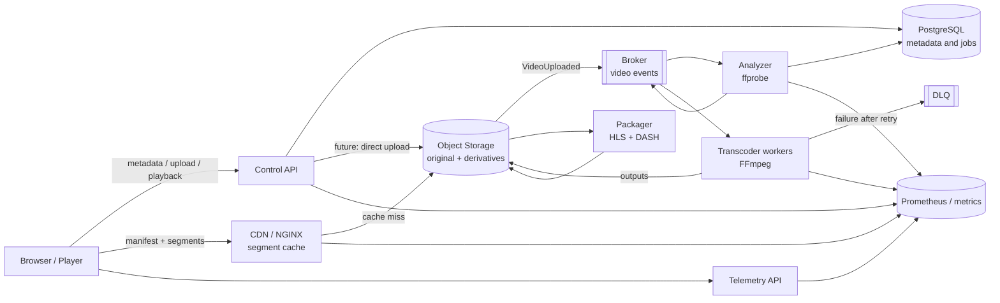

# StreamLab Architecture

The repository contains a minimal local implementation and a target architecture
for study. This distinction matters: the Go API currently uses memory, a local
filesystem, and an in-memory queue; PostgreSQL, Redis, and MinIO are provisioned
services in Compose, but are not yet used by the API code.

## Current Implemented Path


- `POST /videos` with multipart writes the file to local storage, returns `202`,
  and enqueues a `transcode` job; the recommended multipart field is `file`.
- The worker attempts `ffprobe`/`ffmpeg` when the binaries exist. Otherwise, it
  publishes HLS/DASH fixtures to keep the lab executable.
- The processor publishes `hls.m3u8` and `manifest.mpd` and marks the video
  `READY`; the fixture HLS is a media playlist, not a master with a ladder.
- `/videos/{id}/stream` serves the original local file with `Range`; manifests and
  artifacts are served by `/videos/{id}/playback/...`.
- The catalog and telemetry are lost when the API restarts. The queue has a size
  of 32 and in-memory retries, with a default maximum of three attempts and an
  in-memory DLQ.

## Target Architecture Diagram

The diagram below is educational and does not represent connections that are
already implemented:



In the target architecture, the API should not transport segments, object storage
is the source of truth for bytes, consumers are idempotent, and `READY` is only
published after variants are validated. These properties are still evolution
goals, not guarantees of the current lab.

## Compose and Ports

```bash
docker compose up --build
curl http://localhost:3000/api/healthz
```

The frontend is available at `http://localhost:3000`; the proxy uses
`http://localhost:3000/api` for the API. The `api` service exposes `8080` only on
the Compose network. Additional published ports are Postgres `5432`, Redis
`6379`, MinIO `9000` and MinIO console `9001`, Prometheus `9090`, and Grafana
`3001`. This does not change the fact that the Go implementation uses
`LocalStore`; the `DATABASE_URL`, `REDIS_URL`, and `MINIO_*` values in Compose
prepare for the target architecture.

To run the API outside Compose:

```bash
go run ./apps/api
curl http://localhost:8080/health
```

In this mode, `PORT` changes the port and `STREAMLAB_STORAGE_ROOT` (or
`STORAGE_PATH`) changes the `media/` and `artifacts/` directory. The API without
`CORS_ORIGIN` responds with `Access-Control-Allow-Origin: *`.

## Encoding Lab

The scripts in `scripts/` are independent of the API and use local FFmpeg or
Docker when it is unavailable. The API image in Compose also installs
FFmpeg/FFprobe, so Quick Start exercises real probing and HLS packaging:

```bash
scripts/download-bbb.sh
scripts/ffprobe-media.sh --input samples/raw/big-buck-bunny-1080p-normal.mp4 --output samples/generated/bbb.json
scripts/generate-ladder.sh --input samples/raw/big-buck-bunny-1080p-normal.mp4
scripts/generate-hls.sh --input samples/raw/big-buck-bunny-1080p-normal.mp4 --segment-seconds 6 --overwrite
scripts/generate-dash.sh --input samples/raw/big-buck-bunny-1080p-normal.mp4 --segment-seconds 6 --overwrite
scripts/validate-media.sh --input samples/generated/hls --kind hls
scripts/validate-media.sh --input samples/generated/dash --kind dash
```

Use `MEDIA_TOOL=local` to require local tools or `MEDIA_TOOL=docker` to use
`jrottenberg/ffmpeg:6.1-ubuntu`. Always compare the generated manifest, the
`#EXTINF` values, segments, `Representation`, codec, resolution, and bitrate;
`hls_time`/`seg_duration` are targets, so validate the effective duration. If
the API runs outside Compose without FFmpeg/FFprobe, it uses educational fixtures;
this should be treated as a fallback path, not production encoding.

## Public Sources

By default, the API without `DisableSeed` creates `big-buck-bunny`, pointing to
Google's public MP4, and `abr-lab`, pointing to Mux's public HLS master. These
items are remote catalog entries: they have no local bytes or local manifests.
Local upload/generation uses the official Blender source documented in
`samples/README.md`.

## Related Documents

- [HTTP contract](../api-contract.md)
- [ADRs](../adr/README.md)
- [Experiments](../experiments/README.md)
